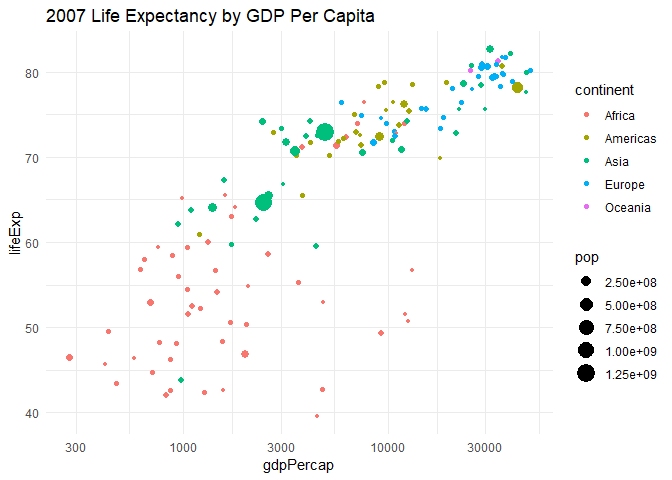
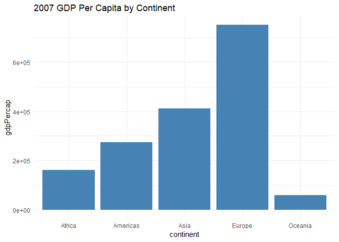
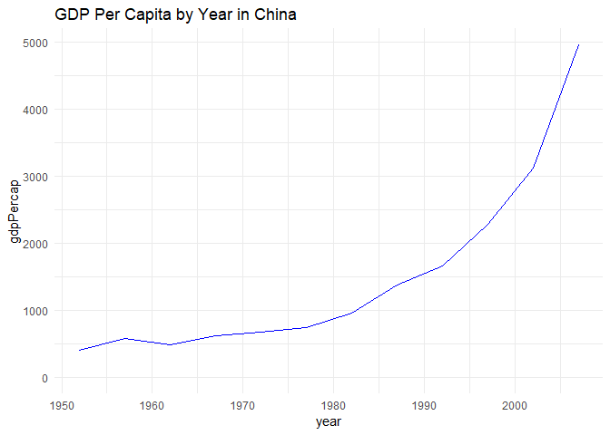

This cheat sheet was developed for a course project in MGSC 790 Data
Resource Management, a Business Analytics elective in the
[PMBA](https://sc.edu/study/colleges_schools/moore/academic_programs/mba_programs/professional_mba/)
program at the University of South Carolina [Darla Moore School of
Business](https://sc.edu/study/colleges_schools/moore/index.php).

It is intended as a quick reference of data structures, functions, and
packages for the R language. Please see the official
[Rdocumentation](https://www.rdocumentation.org/) for a comprehensive
reference.

<br />

#### Table of Contents

###### A little bit of Base R

  [Data structures](#dataStructures)

  [Base functions](#functions)

###### A handful of R packages

  [dplyr](#dplyr)

  [ggplot2](#ggplot2)

  [httr](#httr)

  [jsonlite](#jsonlite)

  [gdata](#gdata)

  [readr](#readr)

  [readxl](#readxl)

  [DBI](#dbi)

  [haven](#haven)

  [RMarkdown](#rMarkdown)

<br />

#### A little bit of Base R

##### <a name="dataStructures"></a>Data structures

A [vector](http://adv-r.had.co.nz/Data-structures.html#vectors) is an
array of homogenous datatypes.

A list similar to a vector but can contain heterogeneous datatypes.

A
[matrix](http://adv-r.had.co.nz/Data-structures.html#matrices-and-arrays)
is a two-dimensional vector of homogenous datatypes.

An array is a vector with one or more dimensions. So, an array with one
dimension is (almost) the same as a vector. An array with two dimensions
is (almost) the same as a matrix. An array with three or more dimensions
is an n-dimensional array.

A [data frame](http://adv-r.had.co.nz/Data-structures.html#data-frames)
is similar to a table in a database. Each column in the data frame holds
the same type, and the columns can have names.

##### <a name="functions"></a>Base Functions

[c](https://www.rdocumentation.org/packages/base/topics/c)

``` {.r}
# combine Values into a Vector or List
c("China", "India", "United States of America")
```

    ## [1] "China"                    "India"                   
    ## [3] "United States of America"

[matrix](https://www.rdocumentation.org/packages/base/topics/matrix)

``` {.r}
# creates a matrix from the given set of values.
matrix(1:9, nrow=3)
```

    ##      [,1] [,2] [,3]
    ## [1,]    1    4    7
    ## [2,]    2    5    8
    ## [3,]    3    6    9

[data.frame](https://www.rdocumentation.org/packages/base/topics/data.frame)

``` {.r}
# creates data frames
worldPop <- data.frame(country, population)
worldPop
```

    ##                    country population
    ## 1                    China 1409517397
    ## 2                    India 1339180127
    ## 3 United States of America  324459463

[subset](https://www.rdocumentation.org/packages/base/topics/subset)

``` {.r}
# return subsets of vectors, matrices or data frames which meet conditions.
subset(worldPop, country=="China")
```

    ##   country population
    ## 1   China 1409517397

[factor](https://www.rdocumentation.org/packages/base/topics/factor)

``` {.r}
# encode a vector as a factor
factor(c("A", "B", "B",  "C", "C", "C"))
```

    ## [1] A B B C C C
    ## Levels: A B C

[gl](https://www.rdocumentation.org/packages/base/topics/gl)

``` {.r}
# generate factor levels
gl(3,1)
```

    ## [1] 1 2 3
    ## Levels: 1 2 3

[levels](https://www.rdocumentation.org/packages/base/topics/levels)

``` {.r}
# provides access to the levels attribute of a variable
lowMedHigh <- gl(3, 1)
levels(lowMedHigh) <- c("low", "medium", "high")
lowMedHigh
```

    ## [1] low    medium high  
    ## Levels: low medium high

[paste](https://www.rdocumentation.org/packages/base/topics/paste)

``` {.r}
# concatenate vectors
paste("this", "is", "a", "concatenation")
```

    ## [1] "this is a concatenation"

[lapply](https://www.rdocumentation.org/packages/base/topics/lapply)

``` {.r}
# apply a function over a list or vector and return a list
lapply(c("a", "b", "c"), toupper)
```

    ## [[1]]
    ## [1] "A"
    ## 
    ## [[2]]
    ## [1] "B"
    ## 
    ## [[3]]
    ## [1] "C"

[sapply](https://www.rdocumentation.org/packages/base/topics/sapply)

``` {.r}
# apply a function over a list or vector and return a vector, matrix, or array
sapply(c("a", "b", "c"), toupper)
```

    ##   a   b   c 
    ## "A" "B" "C"

[vapply](https://www.rdocumentation.org/packages/base/topics/vapply)

``` {.r}
# apply a function over a list or vector and return a vector, matrix, or array of the specified type
vapply(c("a", "b", "c"), toupper, character(1))
```

    ##   a   b   c 
    ## "A" "B" "C"

[identical](https://www.rdocumentation.org/packages/base/topics/identical)

``` {.r}
x <- 1000
y <- 1000

# evalute whether objects are equal
identical(x, y)
```

    ## [1] TRUE

[Sys.Date](https://www.rdocumentation.org/packages/base/topics/Sys.Date)

``` {.r}
# return the current date
Sys.Date
```

    ## function () 
    ## as.Date(as.POSIXlt(Sys.time()))
    ## <bytecode: 0x0000000002ce7648>
    ## <environment: namespace:base>

[Sys.time](https://www.rdocumentation.org/packages/base/topics/Sys.time)

``` {.r}
# return the current date and time
Sys.time
```

    ## function () 
    ## .POSIXct(.Internal(Sys.time()))
    ## <bytecode: 0x000000000ed5dab0>
    ## <environment: namespace:base>

[format](https://www.rdocumentation.org/packages/base/topics/format)

``` {.r}
# format an object for printing
format(13.7, nsmall = 3)
```

    ## [1] "13.700"

[summary](https://www.rdocumentation.org/packages/base/topics/summary)

``` {.r}
# produce result summaries of various model fitting functions
summary(mtcars)
```

    ##       mpg             cyl             disp             hp       
    ##  Min.   :10.40   Min.   :4.000   Min.   : 71.1   Min.   : 52.0  
    ##  1st Qu.:15.43   1st Qu.:4.000   1st Qu.:120.8   1st Qu.: 96.5  
    ##  Median :19.20   Median :6.000   Median :196.3   Median :123.0  
    ##  Mean   :20.09   Mean   :6.188   Mean   :230.7   Mean   :146.7  
    ##  3rd Qu.:22.80   3rd Qu.:8.000   3rd Qu.:326.0   3rd Qu.:180.0  
    ##  Max.   :33.90   Max.   :8.000   Max.   :472.0   Max.   :335.0  
    ##       drat             wt             qsec             vs        
    ##  Min.   :2.760   Min.   :1.513   Min.   :14.50   Min.   :0.0000  
    ##  1st Qu.:3.080   1st Qu.:2.581   1st Qu.:16.89   1st Qu.:0.0000  
    ##  Median :3.695   Median :3.325   Median :17.71   Median :0.0000  
    ##  Mean   :3.597   Mean   :3.217   Mean   :17.85   Mean   :0.4375  
    ##  3rd Qu.:3.920   3rd Qu.:3.610   3rd Qu.:18.90   3rd Qu.:1.0000  
    ##  Max.   :4.930   Max.   :5.424   Max.   :22.90   Max.   :1.0000  
    ##        am              gear            carb      
    ##  Min.   :0.0000   Min.   :3.000   Min.   :1.000  
    ##  1st Qu.:0.0000   1st Qu.:3.000   1st Qu.:2.000  
    ##  Median :0.0000   Median :4.000   Median :2.000  
    ##  Mean   :0.4062   Mean   :3.688   Mean   :2.812  
    ##  3rd Qu.:1.0000   3rd Qu.:4.000   3rd Qu.:4.000  
    ##  Max.   :1.0000   Max.   :5.000   Max.   :8.000

<br />

#### A handful of R packages

There are over 13,000 packages that have been developed to supplement
the R language. Below are a handful that were covered in the the course
work of the [Data Scientist With R
track](https://www.datacamp.com/tracks/data-scientist-with-r) on [Data
Camp](https://datacamp.com). A number of handy packages are provided by
the team at [RStudio](https://www.rstudio.com/products/rpackages/).

<br />

<a name="dplyr"></a>[dplyr](http://dplyr.tidyverse.org/)

``` {.r}
library(dplyr, warn.conflicts = FALSE)
```

dplyr provides a library for data manipulation, including the pipe
operator `%>%` which allows for the chaining of functions

``` {.r}
# filtering and ordering
starwars %>%
  filter(homeworld=="Naboo") %>%
  mutate(taxa = ifelse(species == "Droid", "Machine", "Biological")) %>%
  select(taxa, species, name) %>%
  na.omit() %>%
  arrange(taxa, species, name)
```

    ## # A tibble: 9 x 3
    ##   taxa       species name         
    ##   <chr>      <chr>   <chr>        
    ## 1 Biological Gungan  Jar Jar Binks
    ## 2 Biological Gungan  Roos Tarpals 
    ## 3 Biological Gungan  Rugor Nass   
    ## 4 Biological Human   Cordé        
    ## 5 Biological Human   Dormé        
    ## 6 Biological Human   Gregar Typho 
    ## 7 Biological Human   Padmé Amidala
    ## 8 Biological Human   Palpatine    
    ## 9 Machine    Droid   R2-D2

``` {.r}
# aggregation
starwars %>%
  filter(homeworld=="Naboo") %>%
  group_by(species) %>%
  tally 
```

    ## # A tibble: 4 x 2
    ##   species     n
    ##   <chr>   <int>
    ## 1 Droid       1
    ## 2 Gungan      3
    ## 3 Human       5
    ## 4 <NA>        2

##### <a name="ggplot2"></a>[ggplot2](http://ggplot2.tidyverse.org/)

``` {.r}
library(ggplot2)
library(gapminder) # load gapminder dataset
```

ggplot2 provides a library for visualizing data

``` {.r}
# scatter plot
gapminder %>% filter(year==2007) %>%
ggplot(aes(x=gdpPercap, y=lifeExp, color=continent, size=pop)) +
  geom_point() +  #======  scatter plot
  scale_x_log10() + #=======  logarithmic scale
  theme_minimal() +
  ggtitle("2007 Life Expectancy by GDP Per Capita")
```



``` {.r}
# bar plot
gapminder %>% filter(year==2007) %>%
ggplot(aes(x=continent, y=gdpPercap)) +
  geom_bar(stat="identity", fill="steelblue") + #=====  bar graph
  expand_limits(y=0) +
  theme_minimal() +
  ggtitle("2007 GDP Per Capita by Continent")
```



``` {.r}
# line plot
gapminder %>% filter(country=="China") %>%
ggplot(aes(x=year, y=gdpPercap, color=country)) +
  geom_line(stat="identity", color="blue") + #=====  bar graph
  expand_limits(y=0) +
  theme_minimal() +
  ggtitle("GDP Per Capita by Year in China")
```



##### <a name="httr"></a>[httr](https://www.rdocumentation.org/packages/httr)

httr provides a library for working with HTTP resources

``` {.r}
library(httr)
response <- GET("http://httpbin.org/uuid")
status_code(response)
```

    ## [1] 200

``` {.r}
content(response, "text")
```

    ## No encoding supplied: defaulting to UTF-8.

    ## [1] "{\n  \"uuid\": \"149469d7-4cbf-46d2-8cb2-01885f3c663b\"\n}\n"

##### <a name="jsonlite"></a>[jsonlite](https://www.rdocumentation.org/packages/jsonlite)

jsonlite provides a library for parsing and generating JSON

``` {.r}
library(jsonlite)
fromJSON("http://httpbin.org/json")
```

    ## $slideshow
    ## $slideshow$author
    ## [1] "Yours Truly"
    ## 
    ## $slideshow$date
    ## [1] "date of publication"
    ## 
    ## $slideshow$slides
    ##                       title type
    ## 1 Wake up to WonderWidgets!  all
    ## 2                  Overview  all
    ##                                                                   items
    ## 1                                                                  NULL
    ## 2 Why <em>WonderWidgets</em> are great, Who <em>buys</em> WonderWidgets
    ## 
    ## $slideshow$title
    ## [1] "Sample Slide Show"

``` {.r}
gapminder %>% filter(year==2007, country=="China") %>%
  toJSON()
```

    ## [{"country":"China","continent":"Asia","year":2007,"lifeExp":72.961,"pop":1318683096,"gdpPercap":4959.1149}]

##### <a name="gdata"></a>[gdata](https://www.rdocumentation.org/packages/gdata)

gdata provides a library for manipulating data

##### <a name="readr"></a>[readr](https://readr.tidyverse.org/)

readr provides a library for importing tabular data

##### <a name="readxl"></a>[readxl](https://readxl.tidyverse.org/)

readxl provides a library for reading Excel spreadsheets

##### <a name="dbi"></a>[DBI](https://db.rstudio.com/dbi/)

DBI provides a library for connecting to and executing SQL statements
against a database

##### <a name="haven"></a>[haven](https://www.rdocumentation.org/packages/haven)

haven provides a library for working with datasets from other
statistical software packages (SAS, SPSS, Stata)

##### <a name="rMarkdown"></a> [R Markdown](https://rmarkdown.rstudio.com/)

R Markdown provides a library for generating documents (PDF, HTML,
Markdown) that include R functions and output.

This cheat sheet was produced using R Markdown. The source code for
producing it can be found on
[Github](https://github.com/rowlanch/my-R-cheat-sheet).

<br />

### References

Data structure and function descriptions have been taken from the
[RDocumentation](https://www.rdocumentation.org/) site.

<br />
